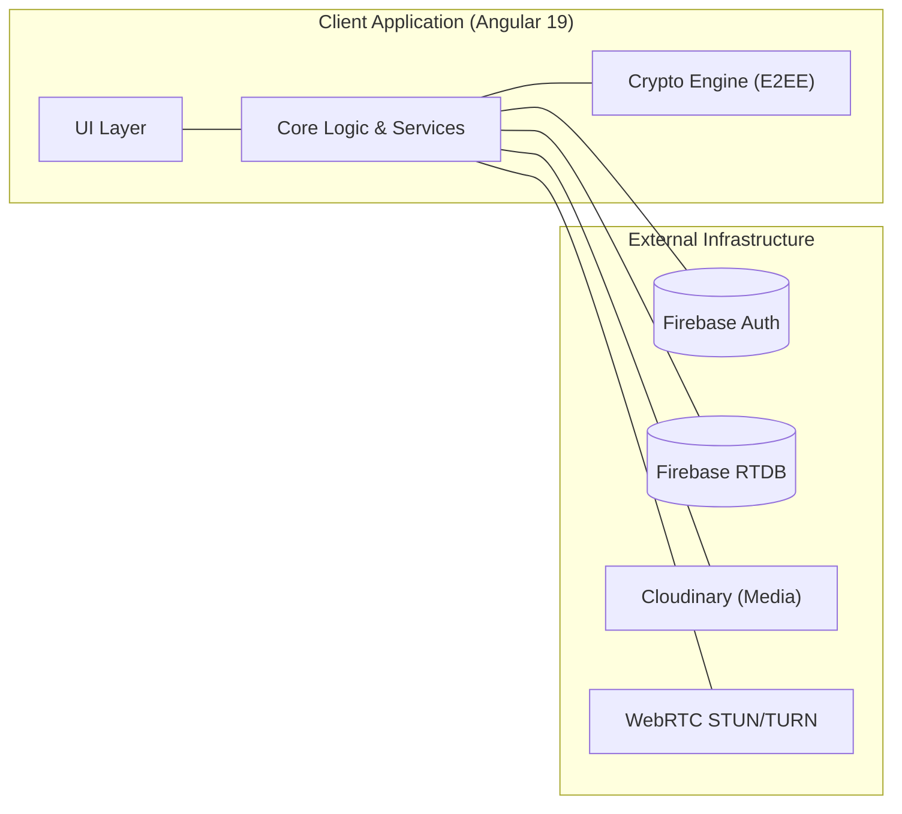
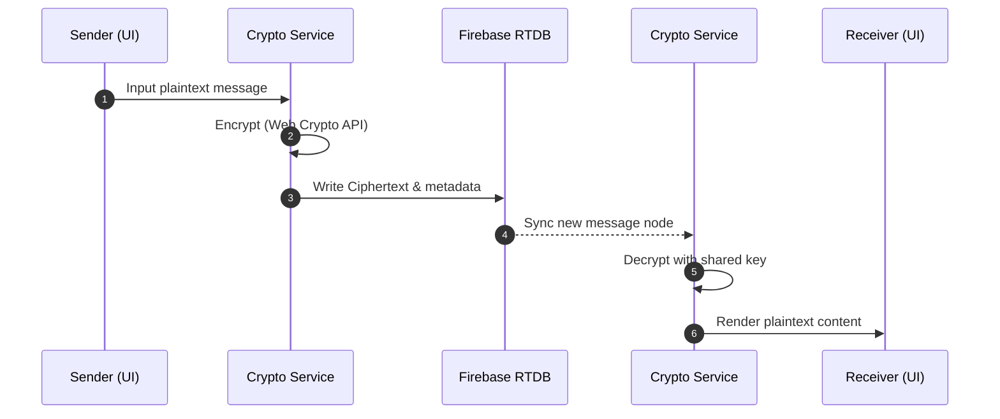
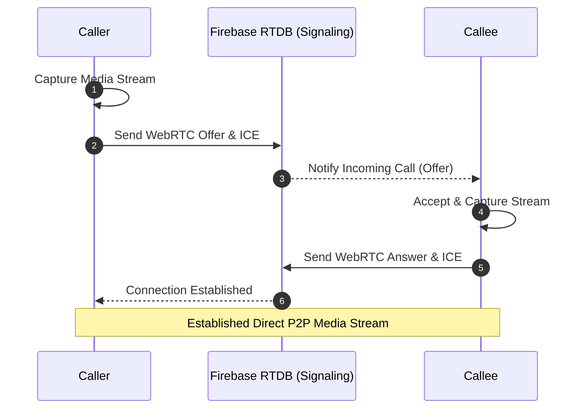

# Mess - Secure Real-Time Messaging App

Mess is a highly secure, feature-rich real-time messaging application MVP built with modern web technologies. It is designed to provide seamless text, voice, and video communication while prioritizing security through End-to-End Encryption (E2EE) and robust real-time database rules.

## Key Features

### Security & Privacy

- **End-to-End Encryption (E2EE):** All 1-on-1 and group chat messages are encrypted natively in the browser using the Web Crypto API before ever reaching the servers.
- **Secure Architecture:** Firebase Realtime Database rules restrict unauthorized access at the node level, ensuring WebRTC signaling and message histories are strictly confined to participants.

### Messaging

- **1-on-1 & Group Chats:** Real-time text messaging with typing indicators, online/offline presence tracking, and read receipts.
- **Group Management:** Robust role-based access control (Admins/Members). Supports group creation, avatar uploads, member promotion/kick, and UUID-based invite links.
- **Voice Messages:** Native microphone integration utilizing the `MediaRecorder` and `Web Audio API`. Features an animated UI waveform while recording and a custom playback controller with variable speeds.

### WebRTC P2P Calling

- **Audio & Video Calls:** 1-on-1 direct peer-to-peer calling using native `RTCPeerConnection` with STUN server fallbacks.
- **Group Mesh Calls:** Scalable group voice calls utilizing a fully P2P Mesh Topology, seamlessly merging incoming audio tracks.
- **Dynamic UI:** Features an `@angular/cdk/drag-drop` draggable floating call window with local PIP (Picture-In-Picture) and an incoming call banner powered by the HTML5 Web Notifications API.

## Technology Stack

- **Frontend Framework:** Angular 19 (Standalone Components, Signals, RxJS)
- **Database & Signaling Server:** Firebase Realtime Database
- **Media Storage:** Cloudinary API
- **Native Web APIs:**
  - WebRTC (Audio/Video streams & P2P signaling)
  - Web Crypto API (E2EE)
  - MediaDevices & Web Audio API (Voice messaging)
  - Notifications API (Background ring alerts)
- **UI Utilities:** Angular CDK

## Project Structure

The project follows a modular, domain-driven design within `src/app/`:

```text
src/app/
├── core/
│   ├── models/       # TypeScript interfaces (User, Message, Group, etc.)
│   └── services/     # Heavy-lifting business logic
│       ├── auth.service.ts         # Firebase Authentication
│       ├── chat.service.ts         # Encrypted message delivery
│       ├── crypto.service.ts       # Web Crypto API handlers
│       ├── webrtc.service.ts       # 1v1 P2P Signaling
│       ├── group-call.service.ts   # Mesh Topology Networking
│       ├── voice-recorder.service.ts # MediaRecorder wrappers
│       └── cloudinary.service.ts   # Media uploads
└── features/
    └── chat/         # UI Components
        ├── call/                 # Draggable WebRTC Window
        ├── incoming-call/        # Web Notification Banner
        ├── chat-window/          # Main conversation interface
        ├── group-info/           # Group settings & members
        ├── voice-recorder/       # Animated recording UI
        └── voice-message/        # Custom audio player UI
```

## Application Architecture & Data Flow

The architecture is divided into specialized modules to ensure high performance and security. The following diagrams detail the system's structural components and its core communication flows.

### 1. High-Level System Architecture
This diagram shows the relationship between the Angular frontend layers and the external infrastructure.



### 2. E2E Encrypted Messaging Flow
Messaging follows a strictly secure path where content is encrypted before leaving the client and decrypted only upon arrival.



### 3. WebRTC P2P Call Negotiation
The calling system uses Firebase only as a signaling intermediary, establishing a direct connection between peers for media streaming.



## Setup & Installation

### Prerequisites

- [Node.js](https://nodejs.org/) (v18+)
- [Angular CLI](https://angular.dev/tools/cli) installed globally (`npm install -g @angular/cli`)
- A Firebase Project (with Realtime Database and Authentication enabled)
- A Cloudinary Account (for media uploads)

### 1. Clone & Install

```bash
git clone <repository-url>
cd mess
npm install
```

### 2. Environment Configuration

You must configure your backend environments before serving the app. Create or update your configuration files (e.g., `src/environments/environment.ts`) referencing the templates provided in the `/references` directory:

- Add your Firebase Config keys.
- Add your Cloudinary cloud name and upload presets.

### 3. Deploy Database Rules

Ensure your Firebase Realtime Database is secured by applying the provided `database.rules.json` file to your Firebase console. This secures the `/calls`, `/group-calls`, and `/messages` nodes.

### 4. Development Server

Run the local development server:

```bash
ng serve
```

Navigate to `http://localhost:4200/`. The application will automatically reload if you change any of the source files.

## License

This project is currently defined as an MVP implementation.
